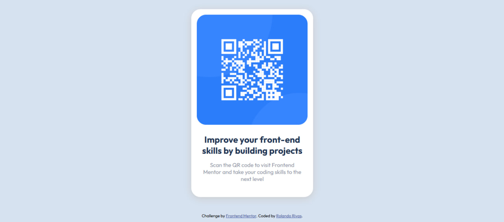

# Frontend Mentor - QR code component solution

This is a solution to the [QR code component challenge on Frontend Mentor](https://www.frontendmentor.io/challenges/qr-code-component-iux_sIO_H). Frontend Mentor challenges help you improve your coding skills by building realistic projects. 

## Table of contents

- [Overview](#overview)
  - [Screenshot](#screenshot)
  - [Links](#links)
- [My process](#my-process)
  - [Built with](#built-with)
  - [What I learned](#what-i-learned)
  - [Continued development](#continued-development)
- [Author](#author)
- [Acknowledgments](#acknowledgments)

**Note: Delete this note and update the table of contents based on what sections you keep.**

## Overview

### Screenshot



### Links

- Solution URL: [Github repository](https://github.com/Rolando0408/qr-code-component)
- Live Site URL: [Live site URL](https://rolando0408.github.io/qr-code-component/)

## My process

### Built with

- Semantic HTML5 markup
- CSS custom properties
- Flexbox

### What I learned

During this project, I learned how to use **Flexbox** to center elements both horizontally and vertically on the screen. This allowed me to create a clean and responsive design. I also reinforced my knowledge of using CSS custom properties to keep the code more organized and maintainable.

Here is an example of the code I used to center my main section:

```css
body {
  display: flex;
  justify-content: center;
  align-items: center;
  height: 100vh;
  margin: 0;
  background-color: hsl(212, 45%, 89%);
}
```

### Continued development

In future projects, I want to focus on improving the following areas:

1. **Responsive Design**: While I was able to create a responsive layout for this project, I want to explore more advanced techniques, such as using CSS Grid and media queries, to handle complex layouts more effectively.

2. **Accessibility**: Ensuring that my projects are accessible to all users is a priority. I plan to learn more about ARIA roles and semantic HTML to improve the accessibility of my designs.

3. **CSS Architecture**: I aim to refine my approach to organizing CSS by exploring methodologies like BEM (Block Element Modifier) or utility-first frameworks like Tailwind CSS.

4. **JavaScript Interactivity**: Although this project didn't require JavaScript, I want to practice adding interactivity to future projects, such as animations or dynamic content updates.

These areas will help me build more robust and user-friendly web applications.

## Author

- Frontend Mentor - [@Rolando0408](https://github.com/Rolando0408)

